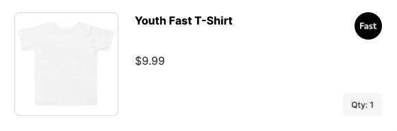

:::info Heads up
Fast displays your logo in the Fast Checkout modal and the Fast Shopper Dashboard to help Shoppers confirm that they're in the right place. This logo is generated automatically based on assets associated with your online store. In some cases, the logo generated is rectangular and doesn't display as expected in Fast windows.
:::

Fast recommends the following logo specifications:

- Square Aspect Ratio
- Designed for a white background (White text needs a black background)
- PNG file
- 200px by 200px minimum
- Ideally hosted on a publicly accessible URL on your site

To use this alternate logo, inform the Fast team during your installation and provide the file or the URL where the image is hosted.

## Example Images

The examples below show the Fast logo uploaded as a square, and how it will be displayed in the Fast Shopper Dashboard.

**Uploaded**

**Automatically Rounded**

**Shopper Dashboard Preview**

